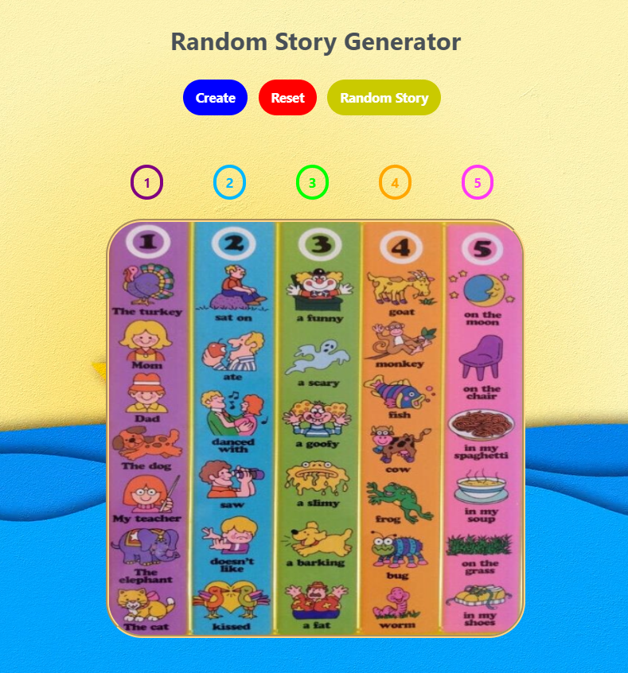

# **Random Story Generator**

## **Introduction**

A Javascript-focused online website game. Inspired by Youtube tutorials.  
Link: https://www.youtube.com/watch?v=gG8y_e6t0G4    
You can clone & run this website in your PC.

## **Programming Language and Technologies used**

* [x] HTML, CSS & JS

* [x] Visual Studio Code

* [x] Git

## **Resources**

1. Class Notes
2. Google

## **Screenshots**

<h2><b>Image</b></h2>

# 
**A Big Thank You!**

